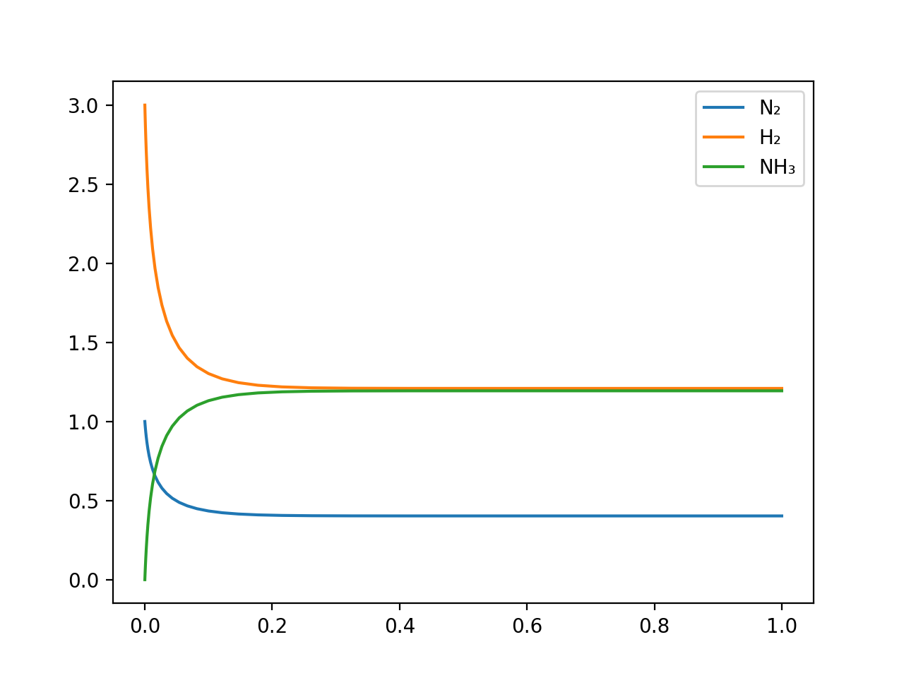
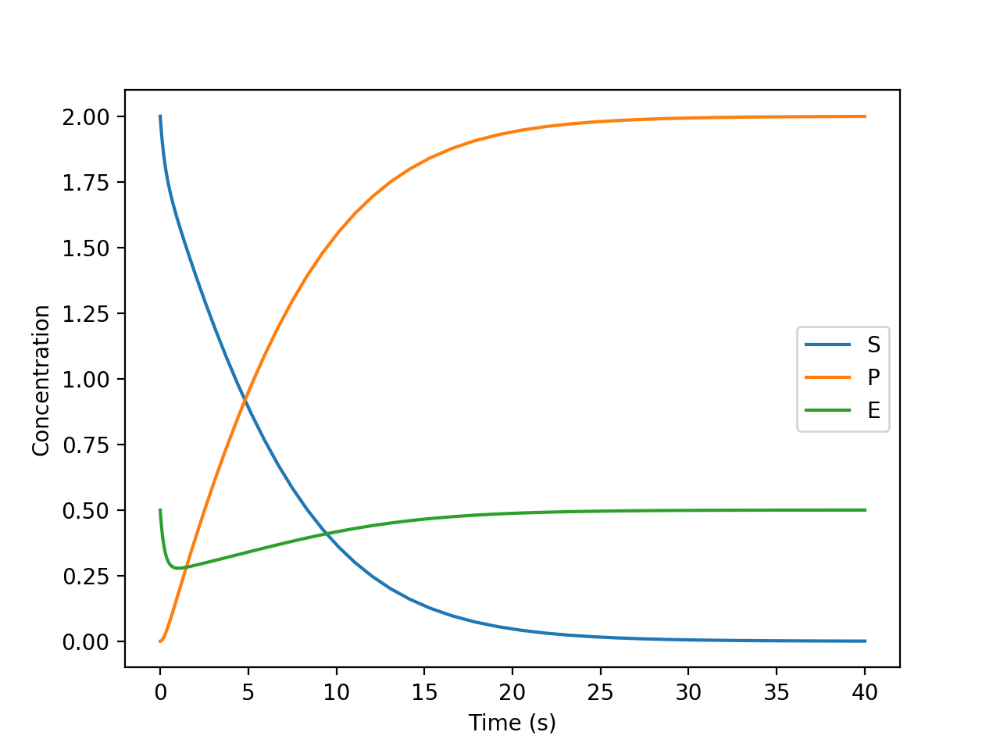
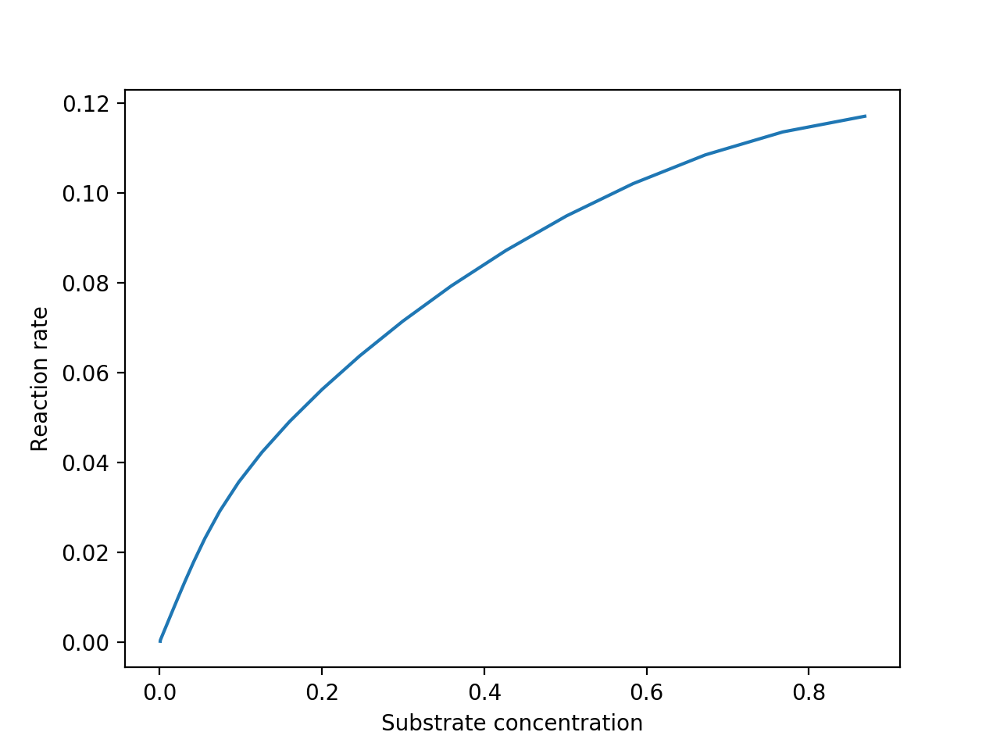
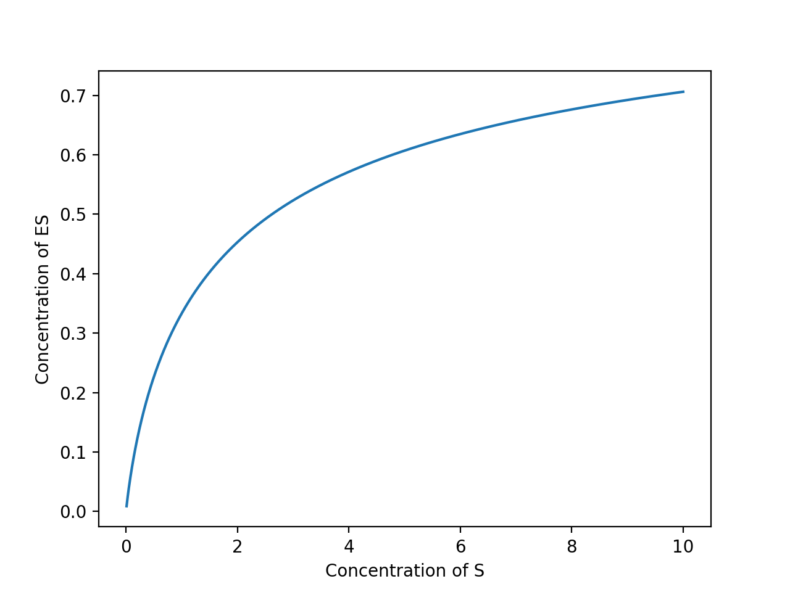

ChemicalReactionNetworks.jl
------

[](https://travis-ci.org/anj1/ChemicalReactionNetworks.jl)
[](https://coveralls.io/github/anj1/ChemicalReactionNetworks.jl?branch=master)

### Introduction

This is a package for simulating Chemical Reaction Networks, of the kind that would be encountered in the study of complex metabolic networks, self-replication, and so on. A high-altitude overview of the capabilities of this package are:

- Basic functions: Specifying reaction networks and solving their time-evolution via mass-action kinetics.
- Reaction network manipulation: Adding external sources or sinks for chemicals, grouping species in terms of chemical complexes.
- Numerical functions: Finding equilibrium/steady states, calculating the contribution of various metabolic cycles, characterizing exponential growth.
- Investigation: Identifying conserved species, identifying closed and open cycles.

#### Quick reference

The main data type in this package is:
```
Reaction(reactant_species,
         reactant_stoichiometric_coefficients,
         product_species,
         product_stoichiometric_coefficients,
         forward_rate,
         backward_rate,
         display_names)
```

When the variable `reactions` is used, it usually refers to a 1-D array of `Reaction`s. A group of reactions can be bundled into a reaction network, where we also specify the total number of species and (optionally) their names:

```
ReactionNetwork(reactions::Vector{Reaction},
                names)  # names optional
```
A quick list of functions:

```julia
# Returns change in concentration over time
mass_action(reactions, concentration)   

# Chemostats certain species and modifies the network.
chemostatted!(reactions, chemostatted_species, chemostatted_concentrations)   

# Returns detailed-balance equilibrium state
equilibrium_state(reaction_net)

# Returns conservation laws of net
conservation_laws(reaction_net)

# Returns cycles
cycles(reaction_net)

# Calculates deficiency of CRN
deficiency(reaction_net)

# Decomposes a CRN in terms of a set of complexes and incidence matrix.
complex_decomposition(reaction_net)
```

### Detailed Reference

A chemical reaction network (CRN from now on) is a list of *reactions*, each reaction having a set of *reactants* and a set of *products*, with each reactant or product being a distinct chemical species. Reactions can be either *reversible* or *irreversible*, with reversible reactions capable of happening in both directions, with a characteristic rate for either direction. An irreversible reaction can be thought of as a reversible reaction with a very small rate in the opposite direction, and in fact in this package the default way of representing reactions is that they can happen in both directions. From this viewpoint, the distinction between 'reactant' and 'product' is arbitrary and depends which direction one is considering. A detailed overview of CRN theory is beyond the scope of this document but excellent references can be found in [[1](#gun2003)] and [[2](#feinberg1979)].

In CRNs, reactions are rarely considered in isolation; one is almost always interested in how different reactions interact and compete with one another in a closed or open system. Because of this, it is assumed that each reaction net has a 'global' list of reactants, and so in each reaction one does not need to explicitly specify the reactants by composition, instead one just refers to them. Thus, for instance, if our list of reactants is: 1. Methane (CH₄), 2. Dioxygen (O₂), 3. Carbon dioxide (CO₂), and 4. H₂O, one can specify the combustion of methane;

<p style="text-align: center;">
 CH₄ + 2O₂ → CO₂ + 2H₂O
</p>

As the following set of lists:

- Reactants: `[1, 2]`
- Stoichiometric coefficients of reactants: `[1, 2]`
- Products: `[3, 4]`
- Stoichiometric coefficents of products: `[1, 2]`

And in this package, this is represented as follows:

```julia
Reaction([1, 2], [1, 2], [3, 4], [1, 2], k, 0)
```

With `k` being the forward reaction rate, and 0 being the effective reverse reaction rate. Note that `k` is dependent on temperature, and at high enough temperature there is a non-zero reverse reaction rate (at very high temperature the forward and reverse rates are effectively the same).

For various reasons, it is advantageous to index species by number rather than by a pointer, symbolic reference, or other kind of arbitrary reference. For example, it makes explicit the ordering used when doing various algebraic manipulations on the net, as shall be seen below.

#### Time-Evolution and Mass Action

Perhaps the most basic thing one might want to do with a CRN is to see how the net evolves in time -- how species are produced and consumed, and what the final concentration of species is. The function to do this is `mass_action`, and it works as follows:

```julia
dz = mass_action(reactions, z)
```

Where reactions is a list of `Reaction`s, and `z` is some instantaneous concentration of all the chemical species. This function returns the *rate of change* of the instantaneous concentration. Thus by feeding this function into an ODE solver, such as a stiff 2nd-order solver, one can solve for the full time-dynamics of the network. Consider a very simple example, a system consisting of just one reaction, the reaction between diatomic nitrogen and diatomic hydrogen to produce ammonia:

```julia
chems = ["N", "H₂", "NH₃"]
reactions = [Reaction([1,2],[1,3],[3],[2],2.0,1.0,chems)]
```

Which gives the output:
```
N₂ + 3H₂ ⇋ 2NH₃ [k+:2.0 k-:1.0]
```

We have assumed this is happening at high temperature, so that the forward rate is only twice that of the reverse rate. Starting from a mixture of 3 parts hydrogen and 1 part nitrogen, we can evolve the concentration over time, using the `Rosenbrock23` method from [OrdinaryDiffEq.jl](https://github.com/JuliaDiffEq/OrdinaryDiffEq.jl):

```
using OrdinaryDiffEq
z0 = [1.0, 3.0, 0.0]
eom(z,p,t) = mass_action(reactions,z)
res = solve(ODEProblem(eom,z0,(0.0,1.0)),alg=Rosenbrock23())
```

`eom` (for 'equations of motion') is a helper function that encapsulates the scope so that we don't have to pass `reactions` to the ODE solver. Note that we have specified the solution over the time from 0 to 1.

The arrays `res.t` and `res.u` now contain the calculated timesteps and solutions for each timestep:

<!--
	using PyPlot
	plot(res.t,[zz[1] for zz in res.u],res.t,[zz[2] for zz in res.u],res.t,[zz[3] for zz in res.u])
	legend(chems)
	savefig("/tmp/example.png",dpi=200)
-->


The solution converges to a roughly equal concentration of ammonia and hydrogen, as expected.

A quick note about solver methods for chemical reactions: It is recommended to use a *stiff* solver method, such as `Rodas4`, `Rosenbrock23`, or `TRBDF2`. Non-stiff higher-order solvers such as `DP5` are prohibitively slow for most CRNs. Check [this reference page](https://docs.juliadiffeq.org/latest/solvers/ode_solve.html) for more information on the available solvers and where to use them.

#### Michaelis-Menten Kinetics

Here is a more realistic example - an example of enzyme kinetics given by the Michaelis-Menten model, which is one of the most commonly used models of enzymatic activity. Let S be a substrate, E be an enzyme, and P be a product. The enzyme catalyzes the production of P from S, as follows:

```julia
chems = ["S","P","E","ES"]
reactions = [Reaction([1,3],[1,1],[4],[1],1.0,1.0,chems),
             Reaction([4],[1],[2,3],[1,1],1.0,0.0,chems)]
```

```
 S + E ⇋ ES [k+:1.0 k-:1.0]
 ES → P + E [k+:1.0]   
```

Here we have assumed a simplified model where all the reaction rates are 1. Initalizing this to substrate concentration 2, enzyme concentration 1, and product concentration 0, and solving with the same `Rosenbrock23()` method, we have:

<!--
z0 = [2.0, 0.0, 0.5, 0.0]
eom(z,p,t) = mass_action(reactions,z)
res = solve(ODEProblem(eom,z0,(0.0,40.0)),alg=Rosenbrock23())
plot(res.t,[zz[1] for zz in res.u],res.t,[zz[2] for zz in res.u],res.t,[zz[3] for zz in res.u])
xlabel("Time (s)")
ylabel("Concentration")
savefig("/tmp/example.png",dpi=200)
-->


<!--
	We can also plot the substrate concentration vs. reaction rate, and we get the characteristic hyperbolic curve:

	prodc = [zz[2] for zz in res.u]
	dprodc = prodc[2:end]-prodc[1:end-1]
	subsc = [zz[1] for zz in res.u]
	plot(subsc[31:end], dprodc[30:end])
	xlabel("Substrate concentration")
	ylabel("Reaction rate")
	savefig("/tmp/example.png",dpi=200)

	

-->


#### Steady States

A CRN may have a number of steady states; these are the states where `mass_action` returns zero. In CRN theory, certain steady states have 'special' properties. In particular, some steady states satisfy *detailed balance* conditions or *complex-balanced* conditions. Detailed balance implies that every reaction happens at the same rate in the forward and backward directions. Complex-balance implies that every group of complexes has net zero production/consumption rate. More on this below.

Steady states that satisfy detailed balance are called *equilibrium states*. If a CRN has an equilibrium state, it can be found by solving a linear problem; the function `equilibrium_state` does this:

```julia
equilibrium_state(reaction_net)
```

For the ammonia example above, this function returns:

```julia
julia> ze=equilibrium_state(ReactionNetwork(reactions))
3-element Array{Float64,1}:
 0.9516951530106196
 0.8619728212469777
 1.1040895136738125
```

And we can verify that `mass_action` indeed returns (close to) zero for this:

```julia
julia> mass_action(reactions,ze)
3-element Array{Float64,1}:
  4.440892098500626e-16 
  1.3322676295501878e-15
 -8.881784197001252e-16 
```

Note that finding the equilibrium state is computationally efficient and fast, and does not require solving the ODE.

If the CRN does not have an equilibrium state, then the above function may not return anything meaningful. In such a scenario, we may have to use iterative methods to find the steady state. We can use `SteadyStateProblem` from [DifferentialEquations.jl](https://github.com/JuliaDiffEq/DifferentialEquations.jl) to do this, starting from an initial guess. To do this we wrap `mass_action` in an equation of motion function that also ensures that only positive solutions are found:

```julia
function eom(z,p,t)
    dz = mass_action(reactions,z)
    for i=1:length(z)
        if z[i] < 0
            dz[i] = exp(-z[i])
        end
    end
    return dz
end
steady_z = solve(SteadyStateProblem(eom, z0))
```

For an example for the ammonia case above, this function returns:

```julia
 0.9516951530106196
 0.8619728212469777
 1.1040895136738125
```

Which is the same as the equilibrium solution, which is what we expect since in this system the only steady state solution is the equilibrium solution.

#### CRNS with multiple steady states

Consider the simple catalytic system:

```julia
chems = ["A₂","B","AB","Z","AZ","BZ"]
reactions = [Reaction([1,4],[1,2],[5],[2],1.0,1.0,chems),
             Reaction([2,4],[1,1],[6],[1],1.0,1.0,chems),
             Reaction([5,6],[1,1],[3,4],[1,2],1.0,0.0,chems)]
@show ReactionNetwork(reactions, chems)
```
```
Reaction Network:
 A₂ + 2Z ⇋ 2AZ [k+:1.0 k-:1.0]
 B + Z ⇋ BZ [k+:1.0 k-:1.0]   
 AZ + BZ → AB + 2Z [k+:1.0]   
```

This is a simple chemical system that has multiple steady states. 

#### Pseudo-Reactions and Chemostatting

Before diving into the more advanced abilities of this package, we must first describe an important concept that is used often: *pseudo-reactions*. A pseudo-reaction is a reaction that involves *hidden* or unseen reactants. For example, we can take the combustion of methane:

<p style="text-align: center;">
 CH₄ + 2O₂ → CO₂ + 2H₂O
</p>

 and make O₂ an unseen reactant:

<p style="text-align: center;">
 CH₄ → CO₂ + 2H₂O
</p>

Note that this is no longer a **physical** reaction - methane does not spontaneously produce CO₂ in the absence of oxidant. However, there is nothing stopping us from implementing this as a reaction in code, and indeed, from the code's point of view, this is just as good as any other reaction!

Why would one do this? One situation where pseudo-reactions are useful is when describing situations where some of the reactants are so *abundant* and available (either by being present as well-mixed solvent, or being deliberately replenished or removed externally to maintain a constant concentration) that we model their concentration by a fixed value, simplifying the network dynamics in the process. In these kinds of cases, the reaction rate is thus solely determined by the other, non-hidden reactants. Note that a pseudo-reaction does not need to have any reactants at all! Thus the following:

<p style="text-align: center;">
⇋ H₂O
</p>

Given by `Reaction([],[],[1],[1],1,1)` (With forward and backward rate of 1, and assuming water is reactant no. 1) is a perfectly acceptable reaction. It can be interpreted as 'water is always present in a constant amount' and is useful in CRNs that take place in an aqueous environment and in which some species may react with water. We can imagine that the empty side of the reaction is referring to something happening 'off-screen' that is constantly replenishing our supply of water. Another example might be:

<p style="text-align: center;">
CO₂ →
</p>

Which may, for example, represent CO₂ bubbling out of solution and thus its concentration always being small in solution.

More generally, the idea of fixing the concentration of a species externally is called *chemostatting*, and pseudo-reactions are a way of performing chemostatting without having to write special cases in code. A CRN where some reactants are chemostatted is called an *open* CRN. Otherwise, it is called a *closed* CRN.

In this package, one can fix the concentration of a species by calling the function `chemostatted!`. This function takes a CRN as input, along with a set of species to chemostat and what concentrations to chemostat them to. It then modifies the CRN by removing all the chemostatted species, and adjusting the rate constants of the reactions they participate in so that the network dynamics are the same as before.

For example, we can consider the enzyme example from before, and chemostat the substrate concentration so that we can see the explicit steady-state dependence of the reaction rate on the substrate. We can take the reaction rate to be proportional to the steady-state concentration of ES, the enzyme-substrate complex.

```julia
rt = []
for conc_subs = 0.01:0.01:10.0
    reactions = [Reaction([1,3],[1,1],[4],[1],1.0,1.0,chems),
                    Reaction([4],[1],[2,3],[1,1],1.0,1e-15,chems)]
    chemostatted!(reactions, [1], [conc_subs])
    ez = equilibrium_state(ReactionNetwork(reactions))
    ez[2]=0.0
    ez = ez/sum(ez)
    push!(rt, ez[4])
end
```

Which gives the following plot:
<!--
	clf()
	plot(0.01:0.01:10.0,rt)
	xlabel("Concentration of S")
	ylabel("Concentration of ES")
	savefig("/tmp/example.png",dpi=200)

	-->


### (Auto-)Catalytic Systems

A very useful application of CRNs is investigating catalysis and autocatalysis. The package provides several tools for this purpose.

#### Propensities and Concentration Currents

The function `reaction_currents(reaction, z)` returns a pair of numbers `jf` and `jr` - representing the forward and backward rate of a particular reaction *after* applying the mass-action rule. These are also called the *propensities*. The difference of these two numbers is called the *net current* or *current* of the reaction, and represents the net production or consumption of species by this reaction (in detailed balance, the concentration current of every reaction is zero).

The forward (backward) *specificity* of a reaction is the propensity of the reaction divided by the sum of the (forward) propensities of all the reactions that share at least one reactant (product) species. The function to compute this is `specificity(reaction_net, z)`, which computes the forward and backward specificities of all the reactions and returns an n_reactions×2 array.

#### Exponential Growth

In modeling networks that have phenomena like autocatalytic cycles, it is of interest to be able to study the onset and exponential growth of certain species. Exponential growth is a non-steady, non-equilibrium, transient phenomenon and so it cannot be studied using steady state methods.

An important function that can be used to study exponential growth is the `jacobian` function:

```julia
const_vector,jacobian_matrix=jacobian(reaction_net)
```

The two arrays that this matrix returns, the Jacobian matrix J and the constant vector c, capture the first-order dynamics of the network, such that:

dZ = c + JZ + ... (higher order terms)

Where Z is the concentration vector and dZ is the change in the concentration vector over time. If the reaction net is *linear*, such that every reaction has a maximum of one (non-hidden) reactant, and one product, then all higher-order terms are zero, and this equation fully captures the dynamics of the net. In such a situation, properties like exponential or sub-exponential growth can be read directly off of the eigenvalues of the Jacobian. Even in nets that do not have this property, at certain points during the net's evolution the property may be satisfied. It is also possible that the exponential growth happens over such a small timescale that the contribution from higher-order terms is very small and can be ignored.

<!--
For an example, consider the net:

 A + B ⇋ B + C
     C ⇋ B

In the first reaction, B catalyzes the production of C from A. In the second, B is converted to C. Let us assume that we have chemostatted the fuel (A), then:

```julia
chems = ["A","B","C"]
reactions = [Reaction([1,2],[1,1],[2,3],[1,1],1.0,1.0),
             Reaction([3],[1],[2],[1],1.0,1.0)]

```
-->

#### Quasi-Steady Simulation

Some CRNs can be very complicated and include many reactions happening at different timescales. A way of simplifying the time-evolution of these CRNs is to take the reactions that happen quickly as happening *instantaneously*, so that both sides of those reactions are set to be equal, and thus those reactions (along with any species that only show up in those reactions) are eliminated. This is the *quasi-steady* simplification. This can be very useful, for instance, if the intermediate reactions involve short-lived, high-energy radicals.

In ChemicalReactionNetworks, a CRN can be simplified to a quasi-steady CRN by using the function `quasi_steady`. This function takes the CRN and some reaction rate k, and eliminates all reactions that happen at rate faster than k, by making 

Note that in general this process isn't as simple as just equating the products and reactants.

#### Inquiring Reaction Nets

Given a CRN, one can find its *conservation laws*, which describe the underlying species that are conserved by all the reactions in the CRN. The function `conservation_laws(n_species, reactions)` does this. For instance, let's consider the Michaelis-Menten example:

```
julia> conservation_laws(ReactionNetwork(reactions))
  1   1  0  1
 -1  -1  1  0
```

The resulting matrix can be interpreted as follows. Each column represents a reactant, in this case S, P, E, and ES. Every row represents a conservation law. In the case of the second conservation law here, the law states that the concentration E - P - S is conserved by the system. Indeed, looking at the time evolution of the system we calculated previously, during the entire evolution of the system it stays at a constant value of -1.5. Similary for the first conservation law; it states that S + P + ES stays constant, and indeed it does, at value 2.0.

Note that conservation laws are always *exact* (i.e. they have exactly integer-valued coefficients) and they are independent of reaction rate. Also, note that conservation laws do not depend on rate constants, even rate constants that are zero. This is intentional - it reflects that real-life reactions are always reversible to some degree.

Dual to the concept of conservation laws are the concept of *cycles*. The cycles of the CRN are the set of reactions that, when performed in a certain order and a certain number of times, result in a *zero* change of concentration of the reactants. The function `cycles(reaction_net)` calculates them. Just like conservation laws, cycles are exact and independent of rate constants. Cycles and conservation laws are very helpful for simplifying reaction networks.

#### Complexes

As mentioned before, a complex is a set of species that enter together into a reaction, as either reactant or product. For example, the reaction A₂ + 2Z ⇋ 2AZ, A₂ + 2Z is a complex and 2AZ is a complex. Note that AZ is not a complex in this reaction, nor is A₂ + Z. If another reaction in this system such as A + Z ⇋ AZ existed, then AZ would be a complex, but AZ and 2AZ would be distinct complexes.

Every reaction network can be represented in terms of its complexes, in which case the list of reactions takes on an especially simple form: every reaction has exactly one reactant complex and one product complex. This representation is useful for various manipulations of networks.

In this package, the function `complex_decomposition` returns this representation, in terms of two matrices, a *composition matrix* Γ which associates species to complexes, and an *incidence matrix* ∂ which associates every reaction to a pair of complexes. These two matrices have the property that the stoichiometric matrix ∇ is equal to ∇ = Γ∂. The syntax is:

```julia
composition_mat,incidence_mat = complex_decomposition(reaction_net)
```

#### Petri Nets

Any CRN can be represented in graph form. The way to do this is to assign a vertex to every species and a vertex to every reaction. There is an edge from every species vertex to every reaction vertex that it participates in. Edges are directed according to whether the species is a reactant or product. The resulting graph is called a *petri net*, and certain properties of CRNs can be computed very easily using their petri nets.

The function `petri_net` produces the adjacency matrix for the Petri net of a CRN. The resulting adjacency matrix can then be input directly into, for instance, the `SimpleDiGraph` constructor in [LightGraphs.jl](https://github.com/JuliaGraphs/LightGraphs.jl):

```julia
using LightGraphs
pn = SimpleDiGraph(petri_net(ReactionNetwork(reactions)))
```

With this, it is possible to use the functions in LightGraphs.jl to calculate various properties of the Petri net.

#### Demos

This package has been used to implement the models presented in the following research papers:

- "Design of conditions for emergence of self-replicators"
- "Spontaneous fine-tuning to environment in many-species chemical reaction networks"

#### References

1. <a name="gun2003">Jeremy Gunawardena (2003).</a> ["Chemical reaction network theory for in-silico biologists"](http://vcp.med.harvard.edu/papers/crnt.pdf).
2. <a name="feinberg1979">Martin Feinberg (1979).</a> ["Lecture notes for chemical reaction networks"](https://crnt.osu.edu/LecturesOnReactionNetworks)
